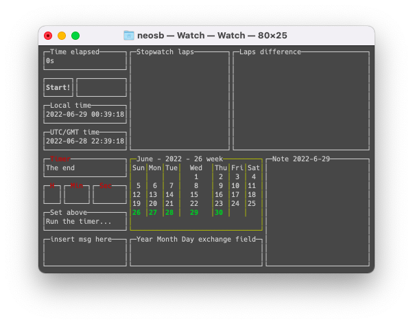

# Watch
Time, Alarm, Timer, Stopwatch

## Prerequisites

Command line interface (Windows, Linux, macOS)

## Usage

Watch it, click it, break it :)

## Author

Szymon Bronisław Błaszczyński [@museyoucoulduse](https://twitter.com/museyoucoulduse) [Neosb](https://neosb.marketplaceinspace.com)

## Contact

[Twitter](https://twitter.com/museyoucoulduse)

[Discord](https://discord.gg/zpZTKTe2)

[Gmail](mailto:museyoucoulduse@gmail.com)

## License

[MIT](https://choosealicense.com/licenses/mit/)